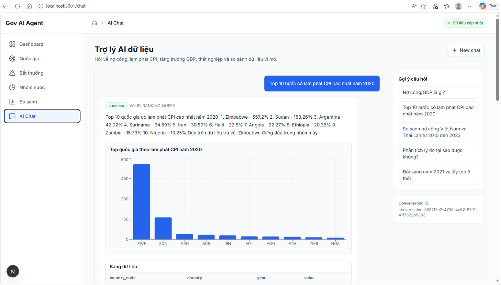

# 🏛️ Government AI Agent Platform
 
> Transforming raw government data into actionable economic insights — powered by AI.
 
---
 
##  Overview
 
Governments sit on vast amounts of economic data — from domestic statistics to international indicators — yet extracting meaningful insights remains a manual, time-consuming challenge.
 
**Government AI Agent Platform** addresses this by building an end-to-end data pipeline that:
- Collects raw data from **multiple domestic and international sources**
- Cleans, transforms, and enriches it into **analysis-ready datasets**
- Feeds it into an **AI agent** that generates high-value economic insights automatically
---
 
##  Use Case
 
A government wants to leverage both national and cross-country data to derive economic insights — GDP trends, inflation forecasts, trade balance analysis, and more.
 
**The challenges:**
- Heterogeneous data sources with inconsistent formats
- Massive volumes of raw, unstructured data
- Hundreds of indicators, most irrelevant to the analysis goal
**Our solution:** An automated pipeline that handles everything from raw ingestion to AI-generated insight delivery.
 
---
 
##  Architecture
 
```
┌─────────────────────────────────────────────────────────────┐
│                                                             │
│    INGESTION            Multi-source data collection        │
│        │                (domestic & international APIs,     │
│        │                files, databases)                   │
│        ▼                                                    │
│    PROCESSING           Cleaning · Transformation           │ 
│        │                Enrichment · Feature Engineering    │
│        │                                                    │
│        ▼                                                    │
│    AI LAYER             Economic analysis & insight         │
│        │                generation via AI Agent             │
│        │                                                    │
│        ▼                                                    │
│    DASHBOARD            Insight visualization &             │
│                         decision-support interface          │
└─────────────────────────────────────────────────────────────┘
```
 
---
 
### ⚙️ Tech Stack

| Layer | Technology |
| :--- | :--- |
| **Data Processing** |    |
| **AI / Agent** |   |
| **Dashboard** |   |
 
---
 
##  Pipeline Details
 
### 1.  Ingestion (Bronze Layer)
- **Sources**: Connects to major international databases including World Bank (WDI), FAOSTAT, and Global Macro Database (GMD).
- **Mechanism**: Supports automated batch ingestion and creates data fingerprints to skip unchanged sources.
- **Storage**: Raw data is stored immutably in a centralized data lake (Bronze Layer) to ensure data lineage and strict auditability.

### 2.  Processing (Silver & Gold Layers)
- **Engine**: Apache Spark (PySpark) orchestrates the high-performance data transformation.
- **Cleaning & Validation**: Handles missing values via null imputation, enforces business constraints (e.g., non-negative GDP), and ensures idempotency (deduplication).
- **Feature Engineering**: Computes window functions for trend analysis (e.g., 5-year rolling means, YoY growth) and anomaly scoring.
- **Standardization**: Converts data into Long-format (Silver) for standardization, then pivots to Wide-format (Gold) in **Google BigQuery** for optimized downstream querying.

### 3.  AI & Agent Layer (Grounded Tool-Use)
- **Semantic Parsing**: Utilizes a LoRA fine-tuned **Qwen3-4B** model to extract precise intents, indicators, countries, and time ranges from natural language questions.
- **Validation**: Enforces strict Data Contracts to prevent the execution of queries with hallucinated or unsupported metrics.
- **Execution & Generation**: Converts parsed JSON into safe BigQuery SQL. The retrieved factual data is then passed to **Google Gemini** to generate grounded, interpretable economic insights.

### 4.  Dashboard & Visualization
- **Tech Stack**: Built with Next.js, Tailwind CSS, and Recharts.
- **Functionality**: Visualizes AI-generated insights and allows decision-makers to interactively filter by country clusters, macro indicators, and anomaly points.
-  
---
 
##  Getting Started
 
```bash
# Clone the repository
git clone https://github.com/DataMeowTt/Government-Ai-Agent-Platform.git
cd Government-Ai-Agent-Platform
 
# Install dependencies
pip install -r requirements.txt
 
# Run the pipeline
# TODO: add run instructions
```
